# Systèmes asservis sous MATLAB / Simulink

Trois TP de commande : le pilote automatique de vitesse d'un train (régulateur proportionnel avec saturation et perturbation), la puissance d'une centrale thermique (réponse inverse, analyse fréquentielle, régulateur P puis PI continu et discret) et un régulateur programmé échantillonné soumis à différentes perturbations.

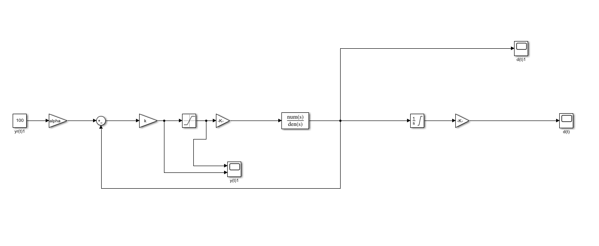

## Vue d'ensemble

- **Cadre** : TP de systèmes asservis, cycle ingénieur Instrumentation, Sup Galilée (Université Sorbonne Paris Nord), septembre–novembre 2024.
- **Équipe** : binôme avec Sarah Dahmoun.
- **État** : TP terminés. Les comptes rendus sont des versions de travail ; pas de compte rendu retrouvé pour le TP 3.

## Objectifs

1. Construire un simulateur Simulink à partir d'un modèle mathématique.
2. Fermer la boucle avec un régulateur proportionnel, puis vérifier un cahier des charges (erreur, saturation, perturbation).
3. Relier la réponse temporelle et la réponse fréquentielle d'un système.
4. Régler un régulateur PI, puis le discrétiser.
5. Étudier un régulateur programmé échantillonné face à des perturbations constantes, sinusoïdales et aléatoires.

## Architecture du système

**TP 1 — pilote automatique d'un train**

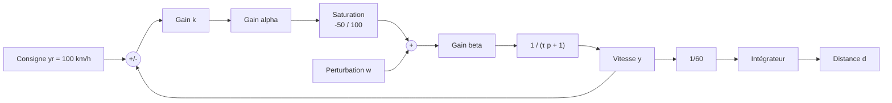

**TP 2 — centrale thermique**

Modèle donné par l'énoncé : `d + 60 ḋ = u`, `x + 120 ẋ = 2 d`, `y = 2 (x − d) − w`, avec `u` la commande du débit de combustible, `d` le débit, `x` le flux thermique, `y` la puissance électrique et `w` une perturbation.

Régulateur PI : `u = −k (e + (1/Ti) ∫ e dt)`, consigne `yr = 50`.

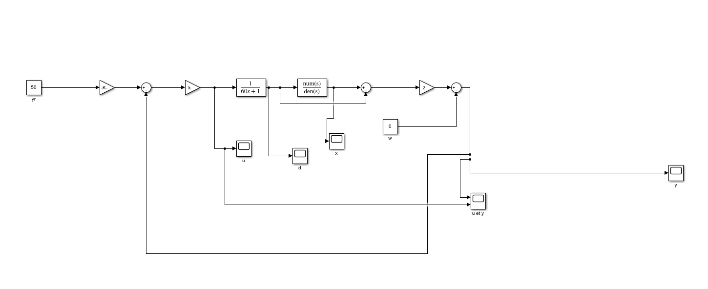

**TP 3 — régulateur programmé échantillonné**

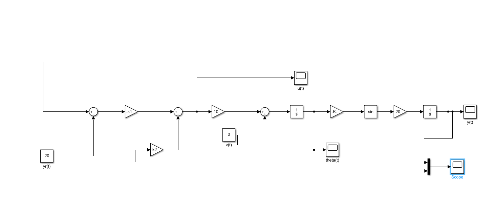

## Logiciel

MATLAB / Simulink : blocs Step, Constant, Gain, Sum, Transfer Fcn, Integrator, Discrete-Time Integrator, Zero-Order Hold, Saturation, Sine Wave, Random Number, Uniform Random Number, MATLAB Function, Scope ; fonctions `tf` et LTI Viewer pour les lieux de Bode, Nyquist et Black.

## Implémentation

| Modèle | Contenu |
|---|---|
| `models/pilote_train_boucle_ouverte.slx` | Fonction de transfert `1/(to·p + 1)`, gains `beta`, `k`, `alpha` et `1/60`, saturation de la commande entre −50 et 100, consigne de 100, perturbation en échelon, intégrateur pour la distance |
| `models/pilote_train_boucle_ouverte_corrige.slx` | Version corrigée du même modèle (différences non documentées) |
| `models/tp1_suite_pilote_automatique/` | Suite du TP 1 : `pilote_automatique.slx`, `pilote_automatique_complet.slx`, `pilote_automatique_question_4.slx`, `parametres_tp1.m` |
| `models/tp2_centrale_thermique/` | `boucle_ouverte.slx`, `boucle_fermee.slx`, `boucle_fermee_pi.slx`, `regulateur_pi_discret.slx`, `parametres_tp2.m` (`k = 0.285`, `Ti = 100`, `Te = 0.01`) |
| `models/tp3_regulation_programmee/` | `tp3_schema.slx`, `parametres_tp3.m` : deux réglages commentés selon le temps de réponse visé (`t5 = 5 s` : `k1 = 9/(10π)`, `k2 = 2/10` ; `t5 = 2 s` : `k1 = 56.25/(10π)`, `k2 = 1/2`), `f = 0.001` Hz, `Te = 0.02` s (fe = 50 Hz) |

Pour le TP 1, le compte rendu donne `β = 4`.

## Principes d'ingénierie

- **Premier ordre** : `F(p) = β / (τ p + 1)`, stable car le pôle `−1/τ` est négatif ; gain statique `F(0) = β`.
- **Régulateur proportionnel** avec précompensation `α` pour un gain statique unitaire en boucle fermée.
- **Saturation de la commande** : comparaison entre commande calculée et commande appliquée.
- **Système à réponse inverse** (TP 2) : la puissance commence par diminuer avant de rejoindre sa valeur finale.
- **Stabilité en boucle fermée selon le gain** (TP 2) : convergence, oscillations puis divergence quand `k` augmente.
- **Action intégrale** : annulation de l'erreur statique, y compris en présence de perturbation.
- **Discrétisation** : bloqueur d'ordre zéro, intégrateur discret, influence de la période d'échantillonnage.

## Résultats

Valeurs relevées dans les comptes rendus (TP 1 et 2) et dans les titres des captures (TP 3) :

| TP | Essai | Résultat |
|---|---|---|
| 1 | Boucle ouverte, `u = 15` pendant 10 s | Vitesse qui tend vers 60 km/h (`β × u`) |
| 1 | Boucle fermée, `yr = 100 km/h` | La vitesse converge vers 100 km/h quel que soit `k` |
| 1 | Cahier des charges | Respecté tant que `k` ne dépasse pas 20 |
| 2 | Échelon `u = 25` | Puissance qui descend d'abord jusqu'à −17 puis se stabilise à 50 |
| 2 | Temps de réponse | 530 s à 5 %, 445 s à 10 %, 355 s à 20 % |
| 2 | Sinusoïde de période 10 s | Amplitude ≈ 0,05 pour `ε = 1`, déphasage mesuré 92° pour 93° attendus |
| 2 | Régulateur P | Converge pour `k = 0.5`, oscille pour `k = 0.75`, diverge pour `k = 1` |
| 2 | PI `k = 0.285`, `Ti = 100` | 1220 s pour atteindre la bande de 10 % (y = 55) ; commande avec un pic ≈ 45 puis stabilisée à 25 |
| 2 | PI avec perturbation `w = 50` | `y → 50`, `u → 50`, erreur `e → 0` |
| 2 | PI discret (`Te = 0.01`) | La sortie converge vers 50 |
| 3 | Réglages `t5 = 5 s` et `t5 = 2 s` | Captures de `y(t)` et `u(t)` |
| 3 | Perturbation `v(t)` constante (5), sinusoïdale, aléatoire puis uniforme | Captures de `y(t)` et `u(t)` |
| 3 | Commande calculée / commande appliquée | Oscillation de `y(t)` attribuée au dépassement de la commande |
| 3 | `Te = 0.05` s, ajout d'une seconde entrée `z(t)` | Captures |

| P, k = 0,5 | P, k = 0,75 | P, k = 1 |
|---|---|---|
| 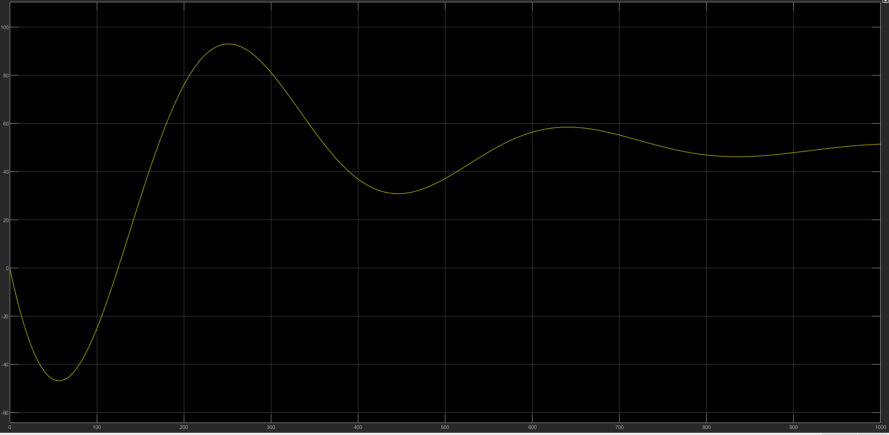 | 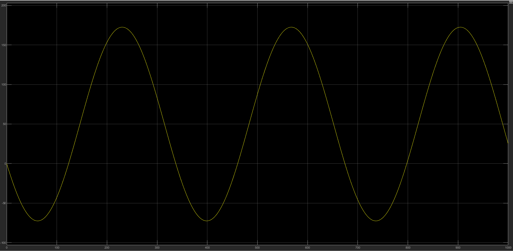 | 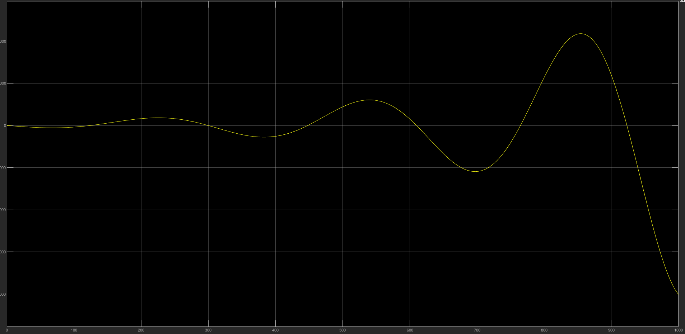 |

| PI continu | Schéma PI discret | PI discret |
|---|---|---|
| 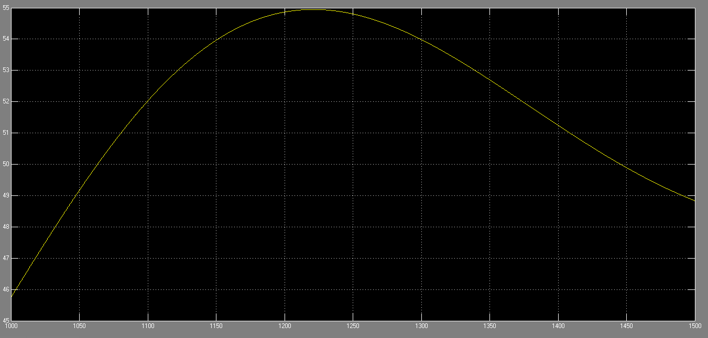 | 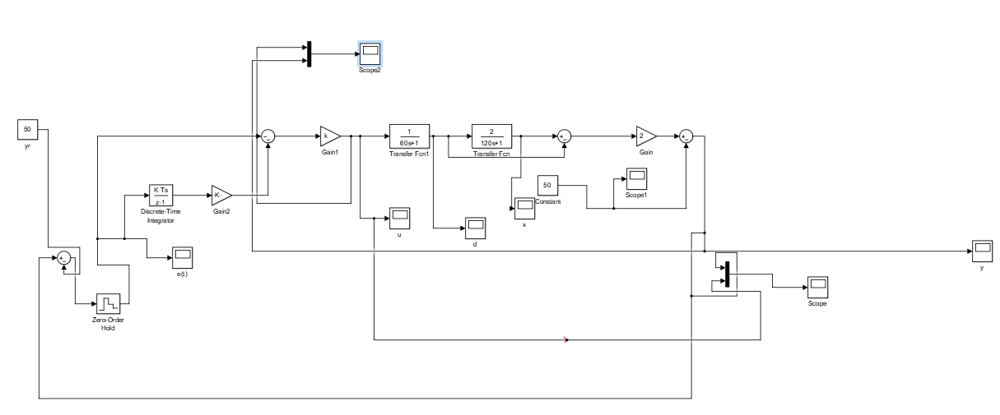 | 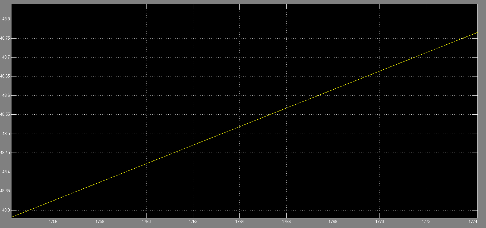 |

| TP 3 — perturbation aléatoire | TP 3 — dépassement de commande |
|---|---|
| 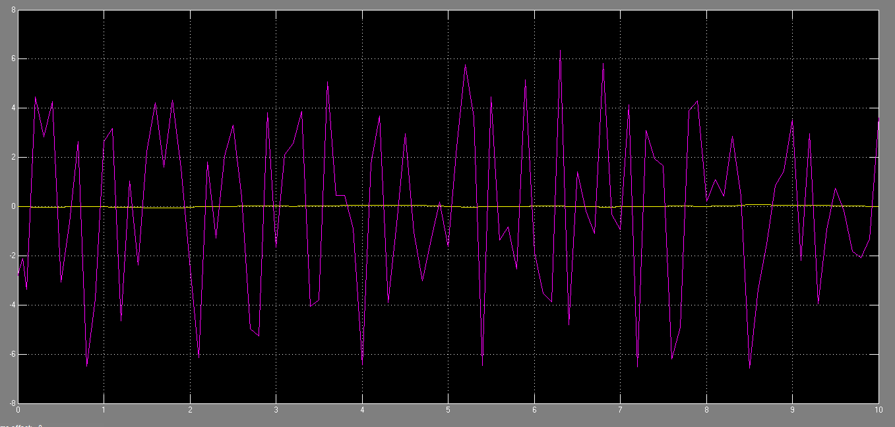 | 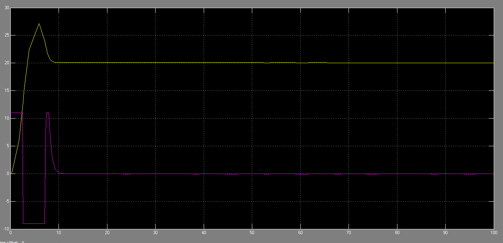 |

## Difficultés et limites

- Comptes rendus non relus : fautes de frappe, et une question laissée sans réponse (valeur finale de la distance au TP 1).
- La seconde mesure fréquentielle du TP 2 (période 100π s) n'est pas faite.
- TP 3 : pas de compte rendu ; l'interprétation se limite aux titres des captures. Le rôle exact de `z(t)` est **à documenter**.
- Simulations non rejouées lors de la rédaction de ce README.

## Structure du dépôt

```
models/   Modèles Simulink (TP 1, TP 1 suite, TP 2, TP 3) et scripts de paramètres
assets/   Captures des schémas et des courbes (préfixes tp2_ et tp3_)
docs/     Comptes rendus (TP 1 .docx, TP 2 PDF, TP 2 régulateur PI .docx)
```

## Exécution

Dans MATLAB : lancer le script de paramètres du TP (`parametres_tp1.m`, `parametres_tp2.m` ou `parametres_tp3.m`), ouvrir le modèle `.slx` correspondant, lancer la simulation et ouvrir les Scopes.

## Compétences démontrées

- Modélisation par fonction de transfert et schéma-bloc.
- Simulation Simulink : saturation, perturbations (constante, sinusoïdale, aléatoire), régulateurs P, PI et programmé.
- Analyse temporelle et fréquentielle (Bode, Nyquist, Black), stabilité selon le gain.
- Discrétisation d'un correcteur et choix de la période d'échantillonnage.

## Licence

Aucune licence n'a été définie.
