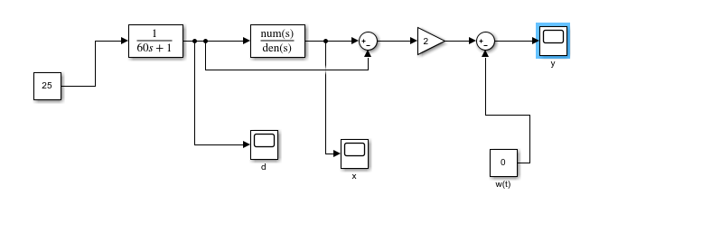
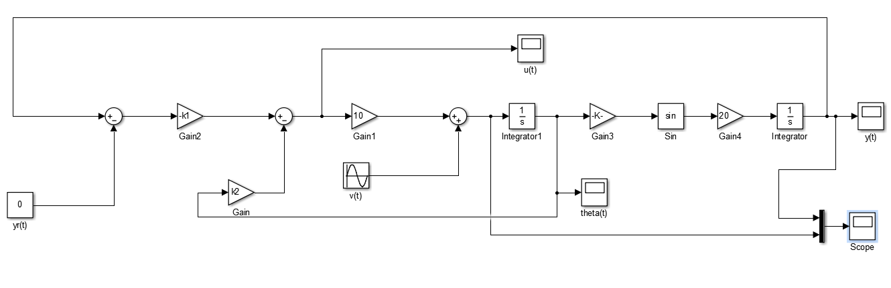

# Control Systems — MATLAB and Simulink

MATLAB/Simulink studies of train-speed control, thermal-power regulation and torpedo depth control.


Academic work developed by Tedj El Moulk Sinacer and Sarah Dahmoun in the Instrumentation engineering programme at Sup Galilée, Université Sorbonne Paris Nord.

The three studies connect physical modelling to controller design: derive the plant dynamics, analyse stability, tune feedback, then compare tracking, actuator demand and disturbance response in Simulink.

## Model portfolio

| Study | Physical system | Engineering focus | Models and parameters |
|---|---|---|---|
| TP1 | Train speed and travelled distance | First-order dynamics, proportional control, reference precompensation and actuator saturation | [Train models](models/tp1_suite_pilote_automatique/) |
| TP2 | Thermal-power process | Nonminimum-phase dynamics, Bode/Nyquist/Nichols analysis, stability boundaries and continuous/discrete PI control | [Thermal models](models/tp2_centrale_thermique/) |
| TP3 | Torpedo depth and pitch angle | Nonlinear kinematics, small-angle linearisation, two-feedback controller design, sampling and disturbances | [Depth-control model](models/tp3_regulation_programmee/) |

Original reports are preserved in [`docs/`](docs/). Block diagrams and simulation captures are in [`assets/`](assets/). The [source map](docs/SOURCE_MAP.md) connects the recovered Drive material to its repository location.

## Train model

### Plant dynamics and position

The train-speed model is a first-order plant:

$$
G(s)=\frac{Y(s)}{U(s)}=\frac{\beta}{\tau s+1}.
$$

Here `y` is speed, `u` the actuator command, `beta = 4` the static gain and `to = 1.2` the time constant in the supplied parameter script. For positive `tau`, the plant pole is `-1/tau`. A sustained command of 15 therefore gives a steady speed of 60 in the undisturbed linear model; a finite pulse has a separate decay after the command returns to zero.

The distance channel integrates speed after a `1/60` conversion. With speed in km/h and distance in km, that conversion corresponds to a simulation time base in minutes. Keep this time base consistent when comparing distance, time constants and speed profiles.

### Proportional control and precompensation

The reference is precompensated **before** the feedback subtraction:

$$
u_{\mathrm{calc}}=k(\alpha y_r-y),
\qquad
\alpha=1+\frac{1}{k\beta}.
$$

Without saturation or disturbance, the closed-loop transfer function is

$$
\frac{Y(s)}{Y_r(s)}
=\frac{k\beta\alpha}{\tau s+1+k\beta}.
$$

The chosen `alpha` makes its DC gain equal to one. Increasing positive `k` reduces the linear closed-loop time constant to `tau/(1 + k*beta)`, while increasing the initial actuator demand.

The actuator limits are **−50 to 100**. The captures compare calculated and applied commands, making the effect of saturation visible alongside speed tracking. The supplied route profile uses workspace arrays `t` and `yr`; the parameter file also defines `k = 10`, `Kd = 0.0001` and `Te = 0.2` for the study variants.

The recovered [proportional-control model](models/tp1_suite_pilote_automatique/pilote_proportionnel_archive.slx) contains reference precompensation, feedback, saturation and a disturbance input. Its original archive filename was `boucle_ouverte.slx`, although its block connections form a closed loop. The repository name reflects the actual model.

Read the [train report](docs/tp1_pilote_automatique_train.docx) together with the [command-saturation capture](assets/commande_avec_saturation.png).

## Thermal model and PI control

### Physical equations and inverse response

The process is described by

$$
d+60\dot d=u,\qquad
x+120\dot x=2d,\qquad
y=2(x-d)-w,
$$

where `u` is the fuel-flow command, `d` and `x` are intermediate process variables, `y` is the controlled output and `w` is an additive output disturbance. With `w = 0`:

$$
G(s)=\frac{2(1-120s)}{(1+60s)(1+120s)}
=\frac{-240s+2}{7200s^2+180s+1}.
$$

The poles are `-1/60` and `-1/120`: **the open-loop plant is stable**. Its zero at `+1/120` lies in the right half-plane, making it **nonminimum phase**. This explains the initial movement opposite to the final response and constrains how aggressively feedback can be tuned.



### Proportional stability boundary

For negative feedback with `e = yr - y` and `u = k*e`, the characteristic polynomial is

$$
7200s^2+(180-240k)s+(1+2k).
$$

For positive gain, asymptotic stability requires **`0 < k < 0.75`**. At `k = 0.75`, the ideal linear model reaches the oscillatory boundary; `k = 1` produces an unstable closed loop. These cases are illustrated by the stored response captures.

The report also uses reference precompensation `alpha = 1 + 1/(2*k)`. It corrects nominal reference gain but does not provide integral rejection of a constant disturbance.

### PI design and sampled implementation

For

$$
C(s)=k\left(1+\frac{1}{T_i s}\right),
$$

the characteristic polynomial becomes

$$
7200s^3+(180-240k)s^2+
\left(1+2k-\frac{240k}{T_i}\right)s+
\frac{2k}{T_i}.
$$

Applying the Routh criterion gives, for `0 < k < 0.75`,

$$
T_i>
\frac{240k}{1+2k}
\left(1+\frac{60}{180-240k}\right).
$$

At the supplied gain `k = 0.285`, the lower bound is approximately **66.99 s**. The selected `Ti = 100 s` satisfies this continuous-time stability condition. The discrete PI study uses `Te = 0.01 s`.


The parameter script converts angular frequency to ordinary frequency using `f = omega/(2*pi)`. For `omega = 0.02 rad/s`, this is approximately `0.003183 Hz`. Use `omega` with analyses expressed in rad/s and `f` with blocks explicitly configured in Hz.

The [thermal PDF report](docs/tp2_centrale_thermique.pdf) and recovered [full Word report](docs/tp2_thermal_control_full_report.docx) contain the step-response, frequency-domain and feedback analyses. The [PI report](docs/tp2_regulateur_pi_compte_rendu.docx) and [PI response](assets/tp2_pi_k0_285_ti100.png) cover controller tuning and disturbance response.

## Torpedo depth control

### Nonlinear plant and feedback law

TP3 studies a torpedo travelling at constant forward speed. Its pitch angle `theta` is expressed in degrees:

$$
\dot\theta=10u+v,
\qquad
\dot y=20\sin\left(\frac{\pi}{180}\theta\right).
$$

The command `u` acts on pitch dynamics; `v` is injected into the **pitch-rate equation**. The controller combines depth error and pitch-angle feedback:

$$
u=-k_1(y-y_r)-k_2\theta.
$$

Depth feedback drives the output toward its reference, while pitch feedback supplies damping.



### Small-angle design and gain selection

Near `theta = 0`, the approximation `sin(theta*pi/180) ≈ theta*pi/180` gives

$$
\dot y\approx\frac{\pi}{9}\theta,
\qquad
p(s)=s^2+10k_2s+\frac{10\pi}{9}k_1.
$$

Matching this polynomial to `s² + 2*zeta*omega_n*s + omega_n²` gives a direct connection between gains, natural frequency and damping.

| Gain set | `k1` | `k2` | Linearised `omega_n` | `zeta` | Reported 5% settling target |
|---|---|---|---|---|---|
| Slower response | `9/(10*pi)` ≈ 0.28648 | `0.2` | 1 rad/s | 1 | 5 s |
| Faster response | `56.25/(10*pi)` ≈ 1.79049 | `0.5` | 2.5 rad/s | 1 | 2 s |

The **faster gains are active** in `parametres_tp3.m`; the slower pair is commented. The report compares these choices for a depth reference of 20 and examines their actuator demand.

### Saturation, sampling and disturbances

The report extends the continuous controller to command limits of **±10**, sample-and-hold behaviour and constant, sinusoidal and random disturbances. The parameter script sets `Te = 0.02 s`, corresponding to **50 Hz**, and `f = 0.001 Hz` for a sinusoidal study. Larger sampling periods introduce more visible differences from the continuous response.

The saved `tp3_schema.slx` is the **continuous nonlinear model**, with the current reference block set to `yr = 0` and the disturbance block to `v = 5`. The [sampled-controller diagram](assets/tp3_schema_avec_z.png) and [command-comparison diagram](assets/tp3_schema_u_calculee_appliquee.png) show the additional configurations studied in the report.

For the linearised model, the disturbance-to-depth transfer function is

$$
\frac{Y(s)}{V(s)}
=\frac{\pi/9}{s^2+10k_2s+(10\pi/9)k_1}.
$$

A constant pitch-rate disturbance therefore produces a finite steady depth offset `v/(10*k1)`. The controller has no integral term; its damping and frequency attenuation should be interpreted separately from elimination of a constant bias.

The recovered [TP3 report](docs/tp3_torpedo_depth_control.docx) supplies the physical equations, gain-design steps and simulation discussion.

## Reported simulation observations

| Study | Configuration | Observation in the archived material |
|---|---|---|
| Train | Reference 100 km/h, proportional feedback and precompensation | Nominal speed tracking with calculated/applied command comparison |
| Thermal plant | Sustained input `u = 25`, `w = 0` | Initial decrease near −17, then convergence toward 50 |
| Thermal P control | `k = 0.5 / 0.75 / 1` | Convergent / oscillatory-boundary / divergent responses |
| Thermal PI | `k = 0.285`, `Ti = 100 s`, disturbance `w = 50` | Return toward `y = 50`, with steady command near 50 |
| Torpedo | Two critically damped linearised gain sets | Comparison of 5 s and 2 s settling targets |
| Torpedo variants | Saturation, sampling and disturbances | Comparison of depth, calculated command and applied command |

These are simulation-study observations from the linked reports and captures. Each response is associated with its input, gain set and model configuration.

## Reproducing a model

MATLAB and Simulink are required. Transfer-function construction and frequency-response analysis also use Control System Toolbox.

```bash
git clone https://github.com/tedjelmoulksn-dotcom/Systemes_Asservis.git
cd Systemes_Asservis
```

Start MATLAB in the repository root. Initialise the relevant workspace **before** opening a model:

```matlab
repoRoot = pwd;

% TP1: recovered proportional train controller
run(fullfile(repoRoot, 'models', 'tp1_suite_pilote_automatique', 'parametres_tp1.m'));
open_system(fullfile(repoRoot, 'models', 'tp1_suite_pilote_automatique', ...
    'pilote_proportionnel_archive.slx'));

% TP2: continuous PI controller
run(fullfile(repoRoot, 'models', 'tp2_centrale_thermique', 'parametres_tp2.m'));
open_system(fullfile(repoRoot, 'models', 'tp2_centrale_thermique', ...
    'boucle_fermee_pi.slx'));

% TP3: continuous nonlinear depth-control model
run(fullfile(repoRoot, 'models', 'tp3_regulation_programmee', 'parametres_tp3.m'));
open_system(fullfile(repoRoot, 'models', 'tp3_regulation_programmee', ...
    'tp3_schema.slx'));
```

Run each study separately so workspace variables correspond to the selected model. Use the model's existing solver and stop-time settings as the starting configuration. For a TP3 tracking experiment, set its reference block to the report's `yr = 20` and choose the disturbance input for that experiment.

For the thermal frequency analysis:

```matlab
Gthermal = tf(2*[-120 1], [7200 180 1]);
pole(Gthermal)
zero(Gthermal)
figure; bode(Gthermal); grid on;
figure; nyquist(Gthermal); grid on;
figure; nichols(Gthermal); grid on;
```

## Engineering review

The portfolio demonstrates the progression from a first-order speed plant to an inverse-response thermal process and a nonlinear depth-control model. The common method is to derive the dynamics, establish the controller's stability conditions, choose gains from the desired response, then examine tracking and command effort together.

The train study highlights the trade-off between faster linear tracking and actuator saturation. The thermal study shows why a stable plant can become unstable under excessive feedback gain and how PI tuning depends on the plant's right-half-plane zero. The torpedo study connects physical angle units, linearisation, damping and sampling to the observed depth response.

## Licence

No project-wide licence has been defined.
